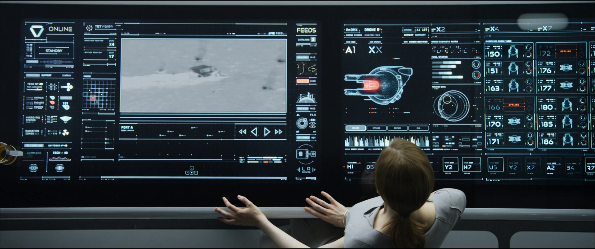

# Aldebarion

Aldebarion is the front-end framework built for the future.



This framework helps you to:

* design interfaces for futuristic smart screens, touch tables and HUDs.
* implement user interfaces for long life application and productivity based on maximum ergonomy and timeless design
* increase efficiency with adaptive interfaces based on human experience

In order to success it, the framework is based on:

1. minimal colors and high contrast
2. smart transitions and elegance
3. full responsiveness taking account of large screens and HUDs FOV
4. several level of reading and adaptability

> This framework is still in development. Point 1 is finished and point 2 is progressing.
Do not hesitate to propose to involve yourself.

## Getting started

This project is more about guidelines than real implementation. You can find all
guidelines [here](doc/guidelines.md).

 Even so, there is a first sass/css implementation.
 It includes basic widgets, animations, layout and default theme.

```bash
npm install aldebarion --save
```

>  More implementation with reactjs will come.

## Documentation

### Semantic language

Since this project is a sass implementation, you may interact with it only through a combination of class names
and attributes. The wording of this implementation is inspired by [Semantic-ui](https://semantic-ui.com/).
It is based on natural language and very simple to use. However, this project is specialized on animations so
you need to use complex html components. In order to help understand what you can change and what you cannot,
the framework uses non-natural language for internal components you should not modify.

*Example:*
```html
<button class="ad button"> <!-- you may add classes here to change the default behavior -->
  <span class="ad buttonLabel"> <!-- you should not change this class, the only thing you can do is to remove it if you don't want it -->
    simple button
  </span>
</button>
```

> Notice that **all** components managed by **Albebarion** must have the class **ad**.

### Responsiveness

First you need to define your screen(s). Most of the time, you can use the next code without questions:

```html

<html>
  <!-- head code -->
  <body class="ad body">
    <div class="ad screen <platform>">
      <div class="ad workspace">
        <!-- your code -->
      </div>
    </div>
  </body>
  <!-- js code -->
</html>
```

* screen: the display place. Available platforms are only `computer` for now.
* workspace: the interaction place (sometimes you may interact on a smaller zone than the full screen especially on very large screens).

> However if your application manages several screens, add several screens div and override the positioning.

### Widgets

A lot of widgets are already designed using the guidelines. The only tricky thing is to correctly build
them in html because several of them have complicated html code (because of animation).

Most of the time a widget is defined by one word. Then you can add class to customize this widgets like `fluid` to expand the widget width or .


* [guidelines](doc/guidelines.md)
* [platforms](doc/platforms/platforms.md)
* [themes & colors](doc/themes.md)


## Links

* [icons](http://themify.me/themify-icons)
* [js animations](https://greensock.com/docs/TweenLite)
